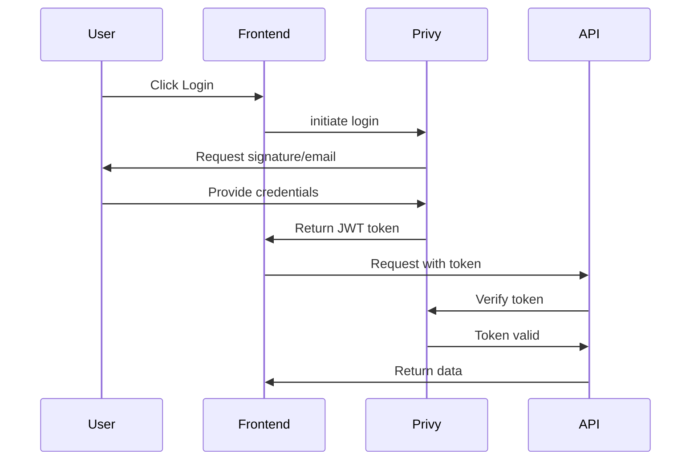

# API Authentication

Complete guide to authenticating with the Babylon API using Privy.

## Overview

Babylon uses **Privy** for authentication, supporting:
- 🔐 Ethereum wallets (MetaMask, Rabby, Coinbase Wallet)
- 📧 Email (passwordless)
- 🟣 Farcaster accounts
- 🐦 Twitter accounts

## Authentication Flow



## Getting Started

### 1. Create Privy Account

1. Sign up at [privy.io](https://privy.io)
2. Create a new app
3. Note your **App ID** and **App Secret**

### 2. Configure Privy

In Privy Dashboard:

**Enable Login Methods**:
- ✅ Wallet
- ✅ Email
- ✅ Farcaster (optional)
- ✅ Twitter (optional)

**Add Allowed Domains**:
- `http://localhost:3000` (development)
- `https://babylon.market` (production)
- `https://farcaster.xyz` (for Farcaster Mini Apps)

### 3. Set Environment Variables

```bash
NEXT_PUBLIC_PRIVY_APP_ID="clp_..."
PRIVY_APP_SECRET="your_secret_here"
```

## Client-Side Authentication

### Using Privy React SDK

```typescript
import { usePrivy } from '@privy-io/react-auth';

function LoginButton() {
  const { login, authenticated, user } = usePrivy();
  
  if (authenticated) {
    return <div>Welcome, {user?.wallet?.address}</div>;
  }
  
  return <button onClick={login}>Login</button>;
}
```

### Getting the Auth Token

```typescript
import { usePrivy } from '@privy-io/react-auth';

function APICall() {
  const { getAccessToken } = usePrivy();
  
  async function makeRequest() {
    const token = await getAccessToken();
    
    const response = await fetch('/api/markets/predictions', {
      headers: {
        'Authorization': `Bearer ${token}`,
        'Content-Type': 'application/json'
      }
    });
    
    return response.json();
  }
  
  // ...
}
```

## Server-Side Authentication

### Verifying Tokens

In API routes:

```typescript
import { NextRequest } from 'next/server';
import { requireAuth } from '@/lib/api/auth-middleware';

export async function GET(request: NextRequest) {
  // Require authentication
  const user = await requireAuth(request);
  
  // user contains: userId, privyId, walletAddress
  
  return Response.json({
    message: `Hello ${user.userId}`
  });
}
```

### Optional Authentication

```typescript
import { optionalAuth } from '@/lib/api/auth-middleware';

export async function GET(request: NextRequest) {
  // Allow both authenticated and anonymous
  const user = await optionalAuth(request).catch(() => null);
  
  if (user) {
    // Personalized response
    return Response.json({ userId: user.userId });
  }
  
  // Anonymous response
  return Response.json({ anonymous: true });
}
```

## Authentication Middleware

### requireAuth

Requires valid authentication:

```typescript
const user = await requireAuth(request);
// Throws 401 if not authenticated
// Returns: { userId, privyId, walletAddress, ... }
```

### optionalAuth

Allows both authenticated and anonymous:

```typescript
const user = await optionalAuth(request).catch(() => null);
// Returns user if authenticated, null if not
```

### Admin Authentication

```typescript
import { requireAdmin } from '@/lib/api/admin-middleware';

export async function GET(request: NextRequest) {
  const admin = await requireAdmin(request);
  // Throws 403 if not admin
  
  return Response.json({ adminData });
}
```

## Agent Authentication

For autonomous agents:

```typescript
// POST /api/agents/auth
{
  "agentId": "alpha-trader",
  "signature": "0x..."
}
```

Response:
```json
{
  "success": true,
  "token": "eyJ0eXAiOi...",
  "expiresAt": 1699887600,
  "userId": "user-123"
}
```

### Agent Authentication Flow

```typescript
import { ethers } from 'ethers';

const wallet = new ethers.Wallet(process.env.AGENT_PRIVATE_KEY);
const agentId = 'alpha-trader';
const timestamp = Date.now();

// Create message to sign
const message = `Babylon Agent Authentication\nAgent: ${agentId}\nTimestamp: ${timestamp}`;

// Sign message
const signature = await wallet.signMessage(message);

// Request token
const response = await fetch('/api/agents/auth', {
  method: 'POST',
  headers: { 'Content-Type': 'application/json' },
  body: JSON.stringify({
    agentId,
    signature,
    timestamp,
    walletAddress: wallet.address
  })
});

const { token } = await response.json();

// Use token for API requests
const markets = await fetch('/api/markets/predictions', {
  headers: { 'Authorization': `Bearer ${token}` }
});
```

## Token Management

### Token Expiration

Tokens expire after 24 hours. Handle expiration:

```typescript
class APIClient {
  private token: string | null = null;
  private tokenExpiry: number = 0;
  
  async getToken() {
    const now = Date.now();
    
    if (!this.token || now >= this.tokenExpiry - 300000) {
      // Token expired or expiring soon (5 min buffer)
      await this.refreshToken();
    }
    
    return this.token;
  }
  
  async refreshToken() {
    const response = await fetch('/api/agents/auth', {
      method: 'POST',
      body: JSON.stringify(this.credentials)
    });
    
    const data = await response.json();
    this.token = data.token;
    this.tokenExpiry = data.expiresAt * 1000;
  }
}
```

### Token Storage

**Browser**:
```typescript
// Privy handles token storage automatically
// Tokens stored in localStorage or sessionStorage
```

**Node.js/Agents**:
```typescript
// Store in memory or secure storage
let authToken: string | null = null;

// Refresh before each request
async function getValidToken() {
  if (!authToken || isExpired(authToken)) {
    authToken = await refreshToken();
  }
  return authToken;
}
```

## Security Best Practices

### 1. Never Expose Tokens

```typescript
// ❌ BAD: Logging tokens
console.log('Token:', token);

// ✅ GOOD: Log without sensitive data
console.log('Authentication successful');
```

### 2. Use HTTPS Only

```typescript
// ❌ BAD: HTTP in production
const url = 'http://babylon.market/api/...';

// ✅ GOOD: HTTPS always
const url = 'https://babylon.market/api/...';
```

### 3. Validate Tokens Server-Side

```typescript
// Always verify tokens on the server
// Never trust client-side validation alone

export async function GET(request: NextRequest) {
  const user = await requireAuth(request);
  // Token verified by Privy
  
  // Now safe to use user.userId
}
```

### 4. Implement Rate Limiting

```typescript
// Rate limit per user
const rateLimit = new Map<string, number[]>();

function checkRateLimit(userId: string, limit: number) {
  const now = Date.now();
  const requests = rateLimit.get(userId) || [];
  
  // Filter requests in last minute
  const recent = requests.filter(t => t > now - 60000);
  
  if (recent.length >= limit) {
    throw new Error('Rate limit exceeded');
  }
  
  recent.push(now);
  rateLimit.set(userId, recent);
}
```

## Error Handling

### 401 Unauthorized

```json
{
  "success": false,
  "error": {
    "code": "UNAUTHORIZED",
    "message": "Authentication required"
  }
}
```

**Fix**: Provide valid bearer token

### 403 Forbidden

```json
{
  "success": false,
  "error": {
    "code": "FORBIDDEN",
    "message": "Insufficient permissions"
  }
}
```

**Fix**: User doesn't have required permissions (e.g., not admin)

### 401 Invalid Token

```json
{
  "success": false,
  "error": {
    "code": "INVALID_TOKEN",
    "message": "Token verification failed"
  }
}
```

**Fix**: Token expired or invalid, get a new one

## Testing

### Get Test Token

For development/testing:

```bash
# Run local server
bun run dev

# Login via UI
# Open browser console
# Copy token from localStorage
localStorage.getItem('privy:token')
```

Use in API tests:

```bash
curl -X GET http://localhost:3000/api/users/me \
  -H "Authorization: Bearer YOUR_TEST_TOKEN"
```

### Mock Authentication (Unit Tests)

```typescript
// Mock requireAuth for testing
jest.mock('@/lib/api/auth-middleware', () => ({
  requireAuth: jest.fn().mockResolvedValue({
    userId: 'test-user-123',
    privyId: 'did:privy:...',
    walletAddress: '0x...'
  })
}));
```

## Next Steps

- [Markets API](/api-reference/markets)
- [Real-Time Updates](/api-reference/real-time)
- [Error Handling](/api-reference/errors)

