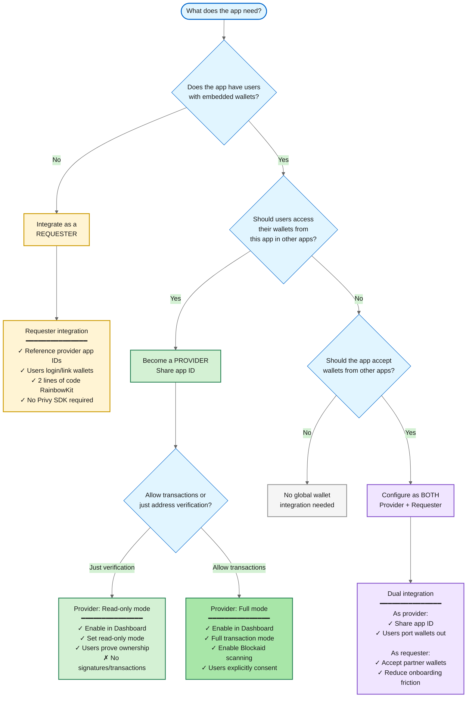

# null

Privy embedded wallets can be made interoperable across apps, making it easy for you to launch your own **global wallet**. In this setup, global wallets foster a cross-app ecosystem where users can easily port their wallets from one app to another, including by integrating wallet connector solutions like RainbowKit and wagmi.

Using **global wallets**, users can seamlessly move assets between different apps and can easily prove ownership of, sign messages, or send transactions with their existing wallets.

## Providers and requesters

Suppose that Alice is logged in to **App A** and wants to connect with her **App B** wallet to prove she owns an asset. In this setup:

* App A is the **requester app**: it *requests* access to a third-party wallet.
* App B is the **provider app**: it *provides* access to embedded wallets generated on its app.

The **provider** and **requester** nomenclature will be used throughout this documentation and the SDK interfaces.

## Choosing your role

Apps can be a provider, a requester, or both, depending on the cross-app wallet experience they want to enable. Use the flowchart below to determine which role fits the app's needs.

### Provider vs. requester comparison

| Feature                | Provider                            | Requester                          |
| ---------------------- | ----------------------------------- | ---------------------------------- |
| **Setup**              | Enable toggle in Dashboard          | Reference provider app IDs in code |
| **Code required**      | Dashboard configuration only        | 2 lines with RainbowKit            |
| **Privy SDK needed**   | Yes                                 | Optional                           |
| **User flow**          | Users consent to share wallets      | Users link or login with wallets   |
| **Security control**   | Set read-only mode, enable Blockaid | Inherits provider's settings       |
| **Dashboard location** | My app tab                          | Integrations tab                   |
| **Use case**           | Enable cross-app wallet ecosystem   | Reduce onboarding friction         |

<Accordion title="When to become a provider">
  An app should become a provider if it:

  * Has existing users with embedded wallets that could be valuable in other apps
  * Wants to build network effects by enabling users to leverage their wallets across partner apps
  * Wants to increase user retention through cross-app utility
  * Wants to control security settings like read-only mode or Blockaid transaction scanning

  **Setup:** Navigate to Dashboard > Global Wallet > My app and enable the toggle.
</Accordion>

<Accordion title="When to integrate as a requester">
  An app should integrate as a requester if it:

  * Wants to reduce onboarding friction by letting users sign in with existing wallets
  * Does not want to manage wallet creation, recovery, or infrastructure
  * Wants users to bring assets and identity from other apps
  * Wants quick integration using standard wallet connectors like RainbowKit or ConnectKit

  **Setup:** Reference provider app IDs and use `toPrivyWallet()` or Privy hooks.
</Accordion>

<Accordion title="When to be both provider and requester">
  An app should configure both roles if it:

  * Wants maximum wallet interoperability in both directions
  * Is building a partnership ecosystem with other apps
  * Wants users to both import wallets from partners and export wallets to partners
  * Wants to tap into other ecosystems while building its own

  **Setup:** Enable provider settings in Dashboard and integrate requester code for partner wallets.
</Accordion>

## User consent and security

<Info>Privy requires that users explicitly confirm all wallet actions in a cross-app context.</Info>

**Global wallets are built to safeguard user privacy and security.** No app developer can view user assets or learn about their address without both:

* The provider app opting into cross-app flows.
* The user explicitly consenting to share their wallet information with the requester app.

By enabling cross-app functionality, the provider's Privy app (hosted on an isolated subdomain) acts as an OAuth-compliant authentication provider. This means requesting apps can initiate the connection, and if the user approves:

* Users are granted a custom access token to make future requests to the provider wallet
* The user's wallet addresses are then attached to the requester's user object as a new cross-app linked account
* If the provider allows for the wallet to be used for signatures and transactions, the requester can request signatures and transactions using the custom access token. Providers can also choose to make their wallets available in read-only mode.

Privy enables the provider to opt into cross-app wallets in **read-only** mode, enabling the requester app to view the user's wallet address but not prompt the user to transact. If transactions are enabled, the user will always be redirected to the isolated subdomain to explicitly approve them, in addition to needing to be logged in to the provider site and holding the custom access token.

Concretely, this means that when a requester app requests a signature or transaction from a user's cross-app wallet, Privy will open up a pop-up to the isolated subdomain, where **the user must confirm the action explicitly.** This means requesters cannot customize wallet prompts when interacting with a provider wallet, and cannot prompt users to export private keys from a provider wallet.

---

> To find navigation and other pages in this documentation, fetch the llms.txt file at: https://docs.privy.io/llms.txt\n